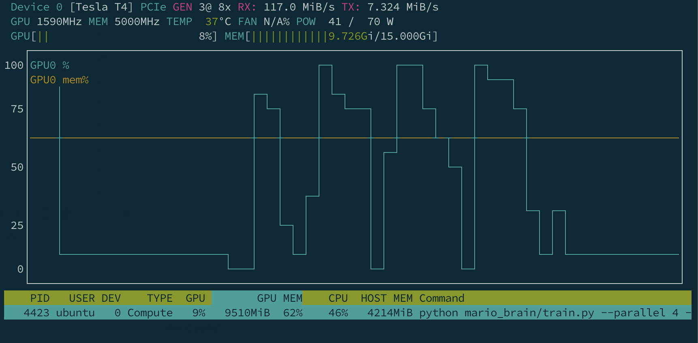

# Terraform Setup for RL Training EC2 Instance (GPU)

This Terraform configuration launches an **on-demand GPU EC2 instance** (e.g., `g4dn.xlarge`) in your private subnet, using the AWS Deep Learning AMI (PyTorch 2.6, Ubuntu 22.04).

## Prerequisites

- Terraform installed (`brew install terraform` or from [terraform.io](https://terraform.io))
- AWS CLI configured with credentials (`aws configure`)
- VPC/Subnet created in your AWS account

## Fill in `dev.tfvars`

Create a `dev.tfvars` file in the same directory as `main.tf` with the following content, you can find dev.tfvars.example as a reference:

```hcl
ssh_key_name    = "akanto-rl-ssh"
public_key_path = "~/.ssh/id-rsa.pub"
subnet_id       = "subnet-xxxxxxxxxxxxxxxx"
vpc_id          = "vpc-xxxxxxxxxxxxxxxx"
owner_tag       = "akanto"
```

## Manage the EC2 Instance

You can use the following commands to launch the EC2 instance:

```bash
terraform init
terraform apply -var-file=dev.tfvars
```

You can terminate the instance using the following command:

```bash
terraform destroy -var-file=dev.tfvars
```

Connect to the instance using SSH:

```bash
ssh ubuntu@<instance-public-ip>
```

## Monitor the EC2 Instance

You can inspect the nvidia-smi output to verify the GPU is available, or check the cpu utilisation:

```bash
nvidia-smi
top -u ubuntu
```

You can use nvtop to monitor the GPU usage:

```bash
sudo apt update
sudo apt install nvtop
nvtop
```


